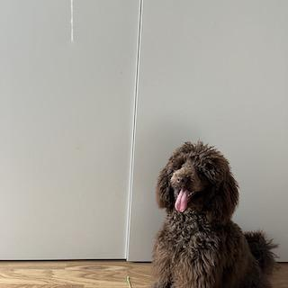

# Inpainting
The goal of the project is to remove a worn-out ball from a photograph. The ball is hanging in the upper-left corner of the image, in front of Irma the dog. The decision was made to first remove color channel 1 (red), as the repetitive process could then be easily handled in order for the next channels 2 (green) and 3 (blue) using a loop.

Steps of the ball removal process, also explained in the MATLAB code comments:
1. Select the area to be removed in pixels
a. size: row*col
b. starting point: inpx, inpy

2. Create a matrix for the area to be removed using the averaging principle (take the average from the 4 surrounding sides), and form matrix A
a. The FD_laplace code is used

3. Get the pixel values on the edges of the area to be removed (their color values)

4. Create the right-hand side vector b

5. Solve the system of equations with: Psol = A\b

6. Replace the removed area with the newly calculated values, for all color channels

  

